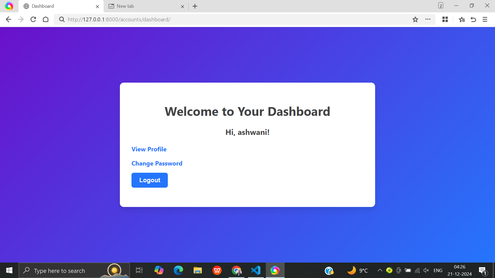
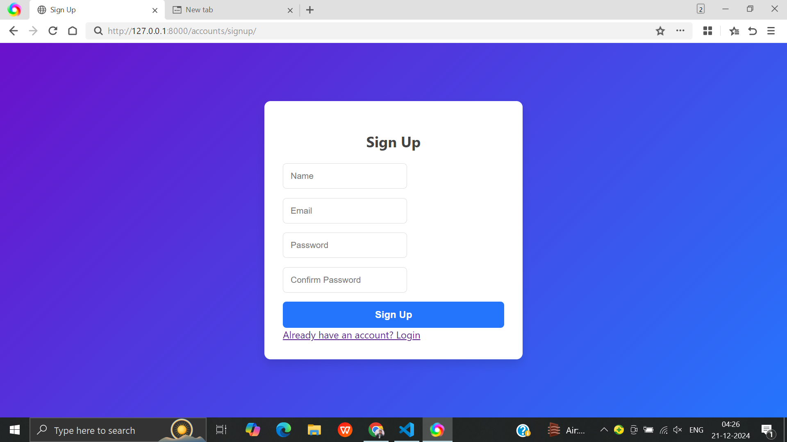
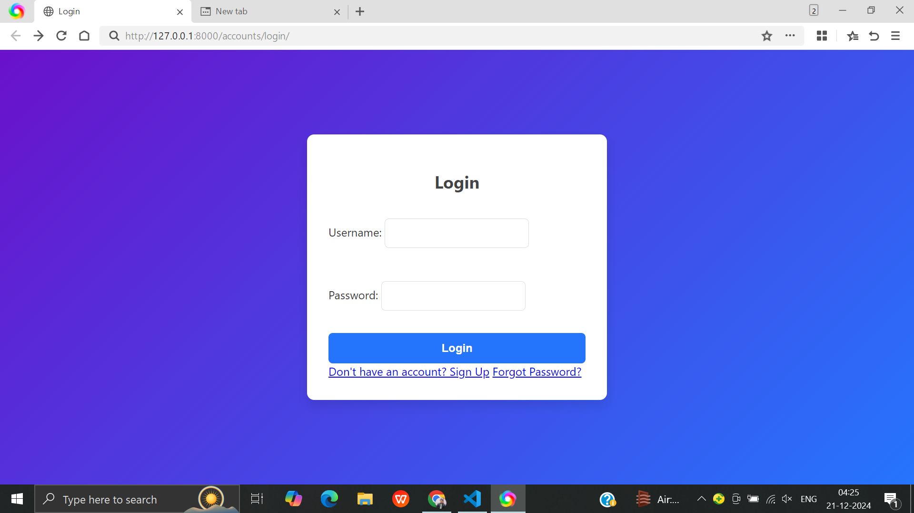
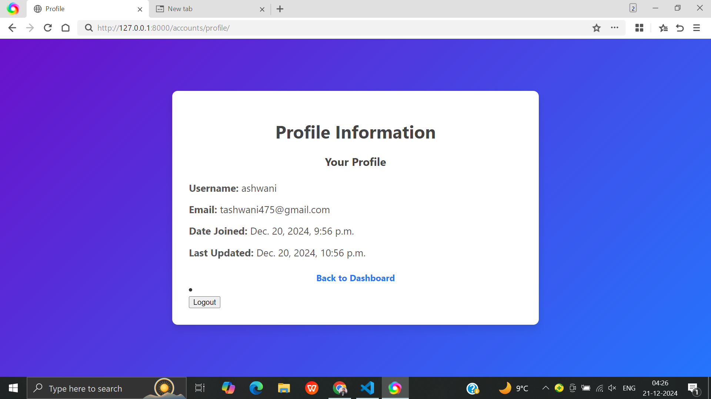
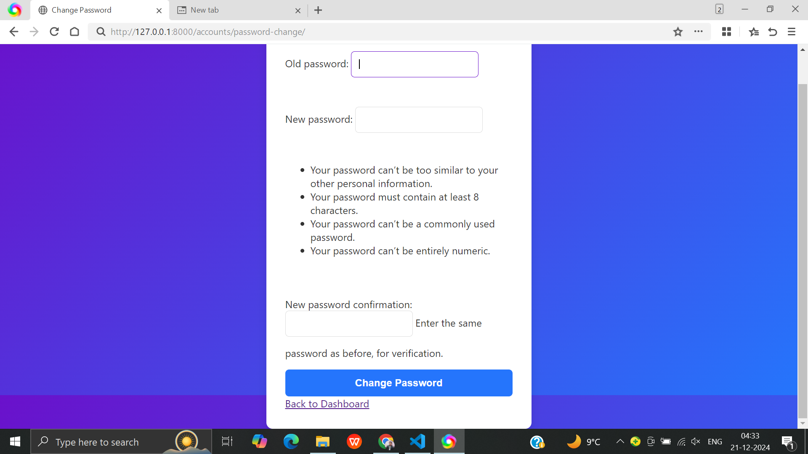
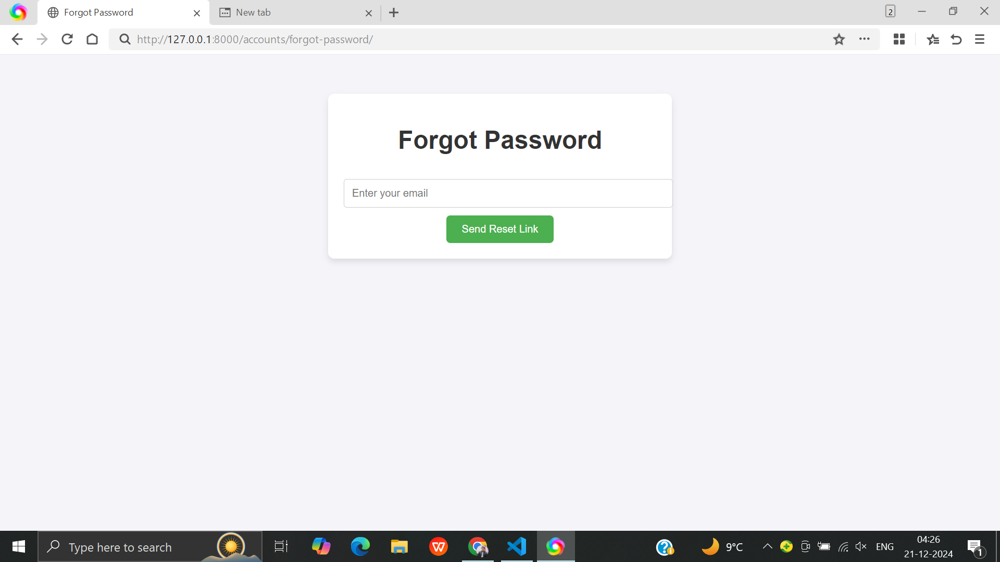
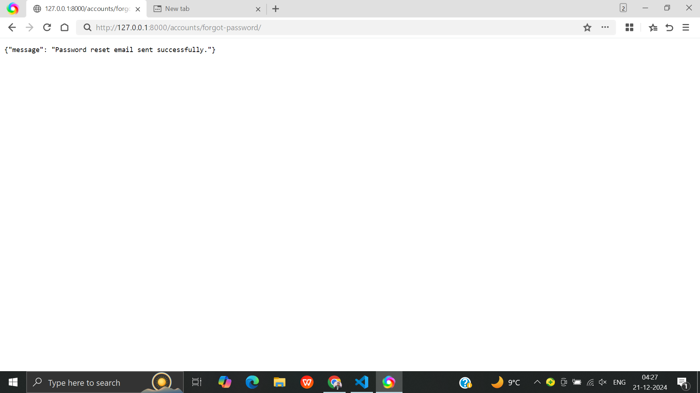
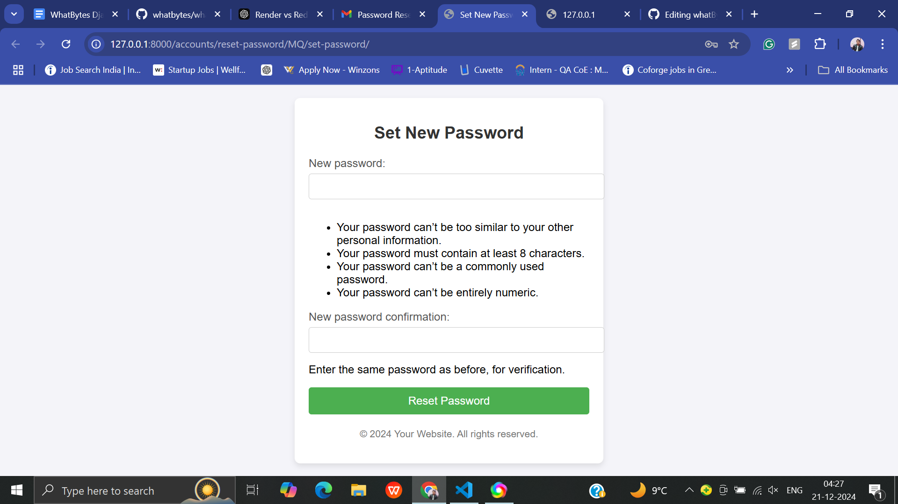
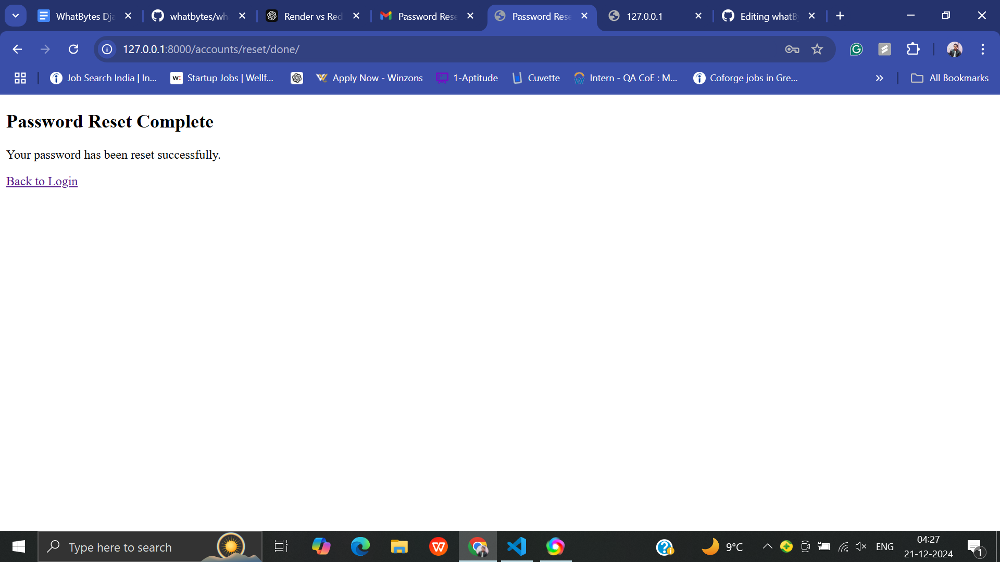

# User Management System

A simple web application to manage user authentication and account functionalities, built with **Django** and customizable themes.

## Features

- **Login**: Users can log in securely with a user-friendly interface.
- **Signup**: New users can register with a responsive signup page.
- **Password Management**:
  - Reset Password
  - Change Password
- **Responsive Design**: The application is fully responsive and mobile-friendly.
- **Custom Theming**: Consistent and visually appealing interface with gradient backgrounds and modern UI elements.

---

## Screenshots
### DashBoard Page


### Signup Page


### Login Page


### Profile Page



### Change Password Page



### Forgot Password Page


### Forgot Password reset mail sent confirmation Page


### Set new password Page

---

### Password reset complete page

---

## Tech Stack

- **Frontend**:
  - HTML5
  - CSS3
- **Backend**:
  - Django
- **Database**: SQLite (default, can be switched to PostgreSQL or MySQL)
- **Templates**: Django Template Engine

---

## Installation

1. Clone the repository:

   ```bash
   git https://github.com/tripathiashwani/whatBytes
   ```
2. Install dependencies:
   ```bash
   pip install -r requirements.txt
   ```
3. Change directory:
  ```bash
  cd backend
  ```

4. Apply migrations
   ```bash
   python manage.py migrate
   ```
5. Run the development server:
   ```bash
   python manage.py runserver
   ```
   
   
   
